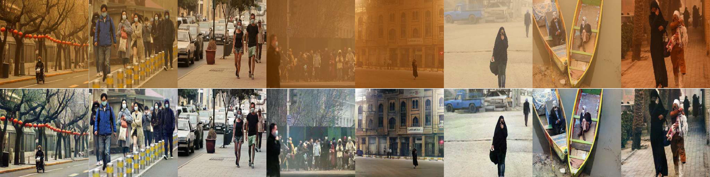

# SSDIE-Net

## Semi-Supervised Sand-Dust Image Enhancement via Attention-Driven Multi-Scale Feature Fusion
### Authors: Mohammed Shamsaddin Qadir, Ako Bartani, Marwan Aziz Mohammed, Fatemeh Daneshfar
### Published in: Under Review

This paper proposed a semi-supervised sand-dust image enhancement method, SSDIE-Net, which integrates the strengths of supervised and unsupervised learning within a unified framework. SSDIE-Net is trained on simulated data using supervised reconstruction loss functions in the supervised branch. It integrates classical image restoration techniques with conditional adversarial networks to generate highly realistic sand-dust images. Moreover, SSDIE-Net adopts consistency regularization, dark channel priors-based regression minimization, Retinex-based pseudo-labeling, and adversarial learning to translate sand-dust images to clean ones in the unsupervised branch. Additionally, we designed an attention-based multi-scale feature fusion network in which feature map extraction from different scales facilitates improved local-to-global learning. Unlike previous methods that focus on extracting local features, SSDIE-Net learns long-range dependencies, which are essential for understanding the overall scene structure.



## Requirements
```
-Python 3.8+
-PyTorch >= 1.10 (CUDA-enabled for GPU training)
-torchvision
-numpy, scipy, pillow
-opencv-python
-cikit-image
-tqdm, matplotlib
```

## Dataset preparation
The dataset structure is illustrated in the following block. The training dataset consists of two folder of real-world sand-dust "dust" and clean images along with their depth maps "clean". We used a subset of COCO images as clean image. For generaing depth map of clean images, we used "depth network" project. Moreover, for testing phase, you can put your sand-dust images in the test folder.

You can download our dataset using [dataset download link](https://drive.google.com/file/d/1BUQ9_QzPyAYzJESfo7UqzxpJ7pwQnHuy/view?usp=sharing). 

```
datasets/
├── train/
│   ├── dust
│   └── clean
└── test
```

You can use the same structure for your dataset. For this, you should change the path of the training and test data in the "config.py".
```
DUST_PATH = "datasets/train/dust"
CLEAN_PATH ="datasets/train/clean"
TEST_PATH = "datasets/test"
```


